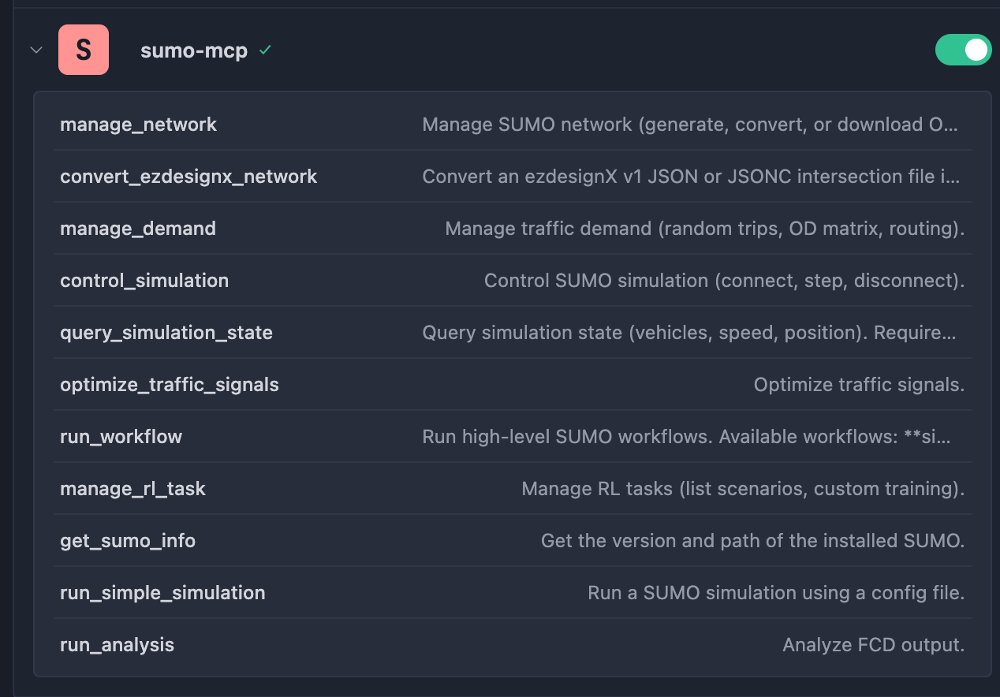

# SUMO-MCP API Reference (FastMCP Tools)

[中文文档](API_CN.md)

This document mirrors the tools registered via `@server.tool` in `src/server.py`, and is intended to provide a stable MCP calling contract for hosts/LLMs.

**Single source of truth**: `src/server.py` (if this document differs from implementation, follow code).



## Environment Requirements

- **Python**: 3.10+
- **SUMO**: 1.23+ (binaries in `PATH`; set `SUMO_HOME` when using tools scripts)
- **Python dependencies**:
  - Runtime: `mcp[cli]`, `sumolib`, `traci`, `sumo-rl`, `pandas`, `requests`
  - Dev (optional): `mypy`, `flake8`, `pytest`, `psutil`, `types-*`

For installation details, see [README.md](../README.md).

## General Conventions

### Return Type
All tools return `string` (success summary/result text, or error text beginning with `Error:`).

### `params.options`
Some tools support `options` (`list[str]`) inside `params`. These options are appended **token-by-token** to underlying SUMO binary/script commands.

Example:

```json
{
  "options": ["--tls.guess", "true", "--default.lanenumber", "2"]
}
```

### SUMO Tools Script Dependency
Features backed by SUMO Python tools scripts (`osmGet.py`, `randomTrips.py`, `tls*.py`, etc.) require resolving `<SUMO_HOME>/tools`.

The project attempts to infer `SUMO_HOME`, but explicitly setting the `SUMO_HOME` environment variable is still recommended for deterministic behavior.

To provide a more concise and intuitive interface, the original 20+ individual tools are merged into 7 core tools. Each core tool distinguishes concrete operations through `action` or `method`.

## 1. Network Management (`manage_network`)

Manage SUMO network generation, conversion, and OSM download.

- **Tool name**: `manage_network`
- **Parameters**:
  - `action` (string):
    - `generate`: Generate abstract networks (Grid/Spider).
    - `convert` (or `convert_osm`): Convert OSM file to SUMO network.
    - `download_osm`: Download map data from OpenStreetMap.
  - `output_file` (string): Output file path (for `download_osm`, this is output directory).
  - `params` (object, optional):
    - `generate`: `{ "grid": bool, "grid_number": int, "spider": bool }`
    - `convert` / `convert_osm`: `{ "osm_file": string }`
    - `download_osm`: `{ "bbox": "w,s,e,n", "prefix": string }`
    - `options`: `list[string]` extra CLI options (see General Conventions)

Notes:
- In `generate`, `spider=true` overrides `grid/grid_number` and forces a spider network.
- For more spider parameters, pass native `netgenerate` flags via `params.options`.

## 2. Demand Management (`manage_demand`)

Manage demand generation, OD conversion, and route computation.

- **Tool name**: `manage_demand`
- **Parameters**:
  - `action` (string):
    - `generate_random` (or `random_trips`): Generate random trips.
    - `convert_od` (or `od_matrix`): Convert OD matrix to trips.
    - `compute_routes` (or `routing`): Run `duarouter`.
  - `net_file` (string): Base network file path.
  - `output_file` (string): Output file path.
  - `params` (object, optional):
    - `generate_random` / `random_trips`: `{ "end_time": int, "end": int, "period": float }` (`end` is compatibility alias)
    - `convert_od` / `od_matrix`: `{ "od_file": string }`
    - `compute_routes` / `routing`: `{ "route_files": string }` (input trips file)
    - `options`: `list[string]` extra CLI options (see General Conventions)

## 3. Simulation Control (`control_simulation`)

Control lifecycle of online SUMO simulation instances.

- **Tool name**: `control_simulation`
- **Parameters**:
  - `action` (string):
    - `connect`: Start a new simulation or attach to an existing instance.
    - `step`: Advance simulation time.
    - `disconnect`: Disconnect and stop simulation.
  - `params` (object, optional):
    - `connect`: `{ "config_file": string, "gui": bool, "port": int, "host": string }`
    - `step`: `{ "step": float }` (default `0`, meaning one step)

## 4. State Query (`query_simulation_state`)

Query real-time simulation state online (vehicles, global state, etc.). Requires an active connection created by `control_simulation`.

- **Tool name**: `query_simulation_state`
- **Parameters**:
  - `target` (string):
    - `vehicle_list` (or `vehicles`): Get all active vehicle IDs.
    - `vehicle_variable`: Get a specific variable for one vehicle.
    - `simulation`: Get global simulation stats (time and vehicle counts).
  - `params` (object, optional):
    - `vehicle_variable`: `{ "vehicle_id": string, "variable": string }`
      - `variable` supports: `speed`, `position`, `acceleration`, `lane`, `route`

## 5. Signal Optimization (`optimize_traffic_signals`)

Run traffic signal optimization algorithms.

- **Tool name**: `optimize_traffic_signals`
- **Parameters**:
  - `method` (string):
    - `cycle_adaptation` (or `Websters`): Cycle adaptation (Webster-based).
    - `coordination`: Green-wave coordination.
  - `net_file` (string): Network file.
  - `route_file` (string): Route file.
  - `output_file` (string): Output file path.
  - `params` (object, optional):
    - `options`: `list[string]` extra CLI options (mainly for `coordination`; see General Conventions)

Output file type notes:
- `cycle_adaptation`: Outputs a SUMO `<additional>` file (contains `<tlLogic>` plans), which must be referenced in `.sumocfg` through `<additional-files>` (not `<net-file>`).
- `coordination`: Also outputs an `<additional>` file by default (TLS offsets), also referenced via `<additional-files>`.

For end-to-end baseline-vs-optimized comparison, use `run_workflow` with `signal_opt`, which handles file wiring automatically.

## 6. Automated Workflows (`run_workflow`)

Execute predefined long-running workflows.

- **Tool name**: `run_workflow`
- **Parameters**:
  - `workflow_name` (string):
    - `sim_gen_eval` (or `sim_gen_workflow` / `sim_gen`): Auto-generate network and evaluate.
    - `signal_opt` (or `signal_opt_workflow`): Full signal optimization comparison pipeline.
    - `rl_train`: RL training workflow.
  - `params` (object): workflow parameter dictionary (supports aliases; priority follows listed order).

### `sim_gen_eval` parameters

| Parameter | Type | Default | Aliases | Description |
|---|---|---|---|---|
| `grid_number` | int | 3 | `grid_size`, `size` | Grid size NxN |
| `sim_seconds` | int | 100 | `steps`, `duration`, `end_time` | Simulation duration (seconds) |
| `output_dir` | string | `"output"` | - | Output directory |

Example:

```json
run_workflow("sim_gen_eval", {"grid_number": 3, "sim_seconds": 1000})
// Equivalent:
run_workflow("sim_gen_eval", {"size": 3, "steps": 1000})
```

### `signal_opt` parameters

| Parameter | Type | Default | Aliases | Description |
|---|---|---|---|---|
| `net_file` | string | **required** | - | `.net.xml` network path |
| `route_file` | string | **required** | - | `.rou.xml` route path |
| `sim_seconds` | int | 3600 | `steps`, `duration` | Simulation duration (seconds) |
| `use_coordinator` | bool | false | - | Use `tlsCoordinator` instead of `tlsCycleAdaptation` |
| `output_dir` | string | `"output"` | - | Output directory |

### `rl_train` parameters

| Parameter | Type | Default | Aliases | Description |
|---|---|---|---|---|
| `scenario_name` | string | - | `scenario` | Built-in scenario name (check via `manage_rl_task("list_scenarios")`) |
| `episodes` | int | 5 | `num_episodes` | Number of episodes |
| `steps` | int | 1000 | `steps_per_episode` | Steps per episode |
| `output_dir` | string | `"output"` | - | Output directory |

## 7. Reinforcement Learning Tasks (`manage_rl_task`)

Manage RL tasks based on [sumo-rl](https://github.com/LucasAlegre/sumo-rl).

- **Tool name**: `manage_rl_task`
- **Parameters**:
  - `action` (string):
    - `list_scenarios`: List built-in scenarios.
    - `train_custom`: Run custom training.
  - `params` (object, optional):
    - `train_custom` supports two inputs (choose one):
      1) **Built-in scenario**:
         `{ "scenario" or "scenario_name", "out_dir"/"output_dir", "episodes"/"num_episodes", "steps"/"steps_per_episode", "algorithm", "reward_type" }`
      2) **Custom files**:
         `{ "net_file", "route_file", "out_dir"/"output_dir", "episodes"/"num_episodes", "steps"/"steps_per_episode", "algorithm", "reward_type" }`

Constraints:
- `list_scenarios` only depends on the `sumo-rl` package itself.
- **Training** strongly depends on `SUMO_HOME` at `sumo-rl` import time, so set `SUMO_HOME` explicitly before training and ensure `sumo` is executable.
- Custom training requires traffic lights (`tlLogic`) in the network; otherwise returns `No traffic lights found`.
- `algorithm` currently implements only `ql` (Q-Learning).

---

## Legacy Tools

These standalone tools remain for compatibility:
- `get_sumo_info`: Get SUMO version info.
- `run_simple_simulation`: Run offline simulation with a config file. Params: `config_path`, `steps` (default: `100`).
- `run_analysis`: Parse FCD output file. Param: `fcd_file`.
